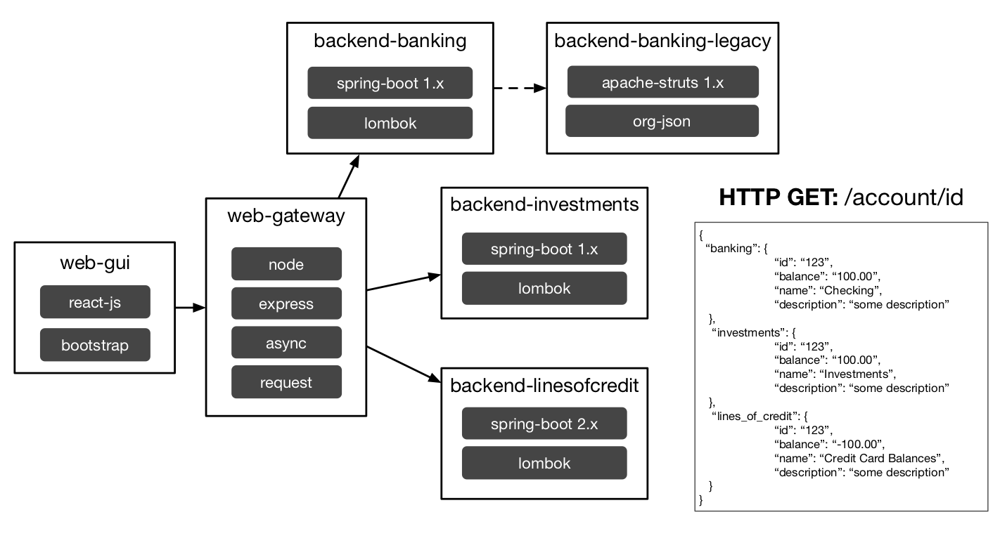
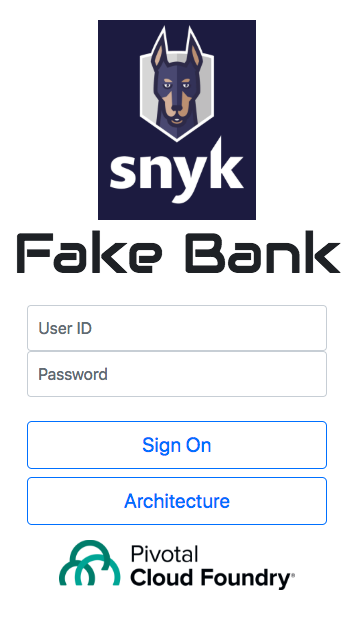
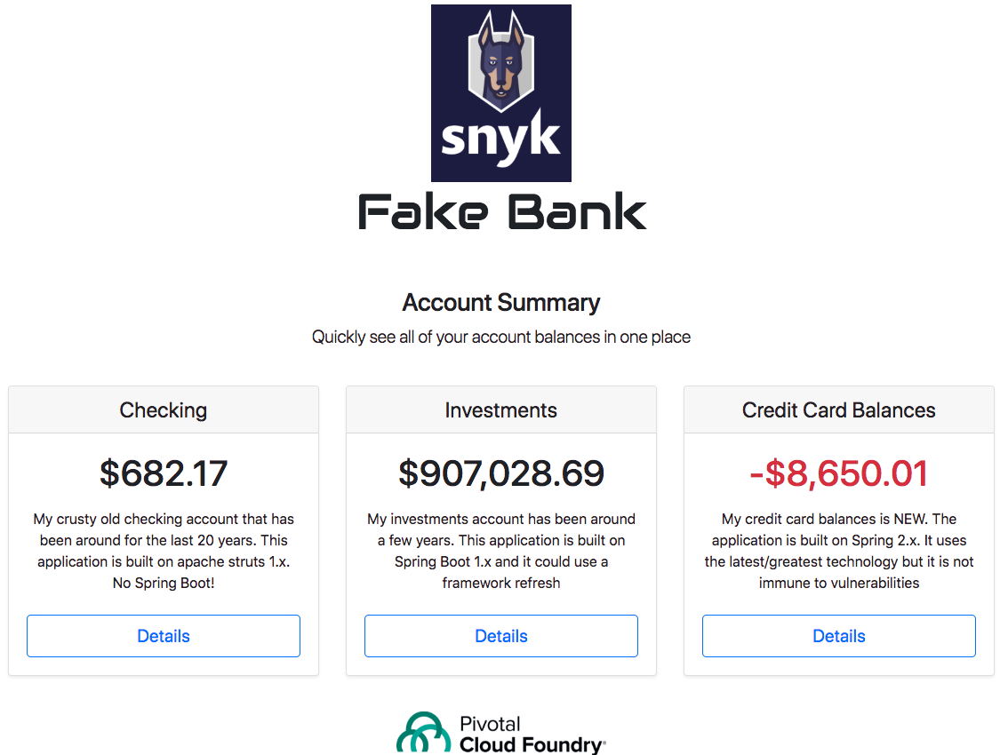
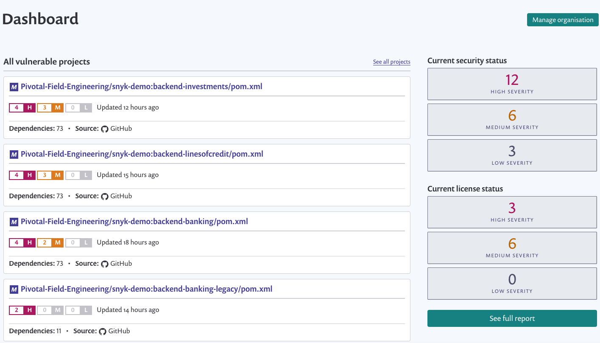

# Installation
* All build and deploy commands live in `pwsBuildDeploy.sh`. 
This is a polyglot demo that builds spring-boot 1.x-2.x, node, react and struts 1.x based projects
* You will need to have node installed to build the `web-gateway` and `web-gui` demo projects.
* The `manifest.yml` file can be used to do a normal `cf push` of all built demo projects. This demo 
will work on any PCF environment that has the node, staticfile and java buildpack.
* You will need to edit the `base_route` entry in `variables.yml`. This base_route will be 
pre-pended to each application's route make it easier to create unique routes without using the `random_route` flag. 
This demo does not use SCS or any other service registry. All microservice endpoints are wired up via environment entries
in the manifest.
* You may need to edit environment variable entries in `./web-gui/src/config.json`. The web gui has web 
links to your snyk dashboard, web gateway and cloud foundry apps manager. The default setting for snyk 
dashboard is: `https://app.snyk.io/org/pivotal-demo/`. The default setting for apps manager 
is: `https://console.run.pivotal.io/`. The default setting for the web gateway is `((base_route))-web-gui.cfapps.io`

# Setup
1. Setup [Github integration](https://app.snyk.io/org/pivotal-demo/integrations) and make sure that all 5 projects are listed in your Dashboard. 
1. Before running the demo script, build and deploy all projects using `./pwsBuildDeploy.sh` or similar commands.
1. Open web-gui URL and verify that clicking on the snyk image takes you to the correct snyk dashboard. 
1. In web-gui URL make sure that the pivotal cloud foundry image takes you to the correct apps manager console
1. Install the [snyk cli](https://snyk.io/docs/using-snyk)
1. Verify the snyk cli works by running `snyk test backend-banking`. You should see some interesting vulnerabilities.

# Demo Script - Short
1. Open the web-gui and Sign-On using any User ID. No password is needed. If the user id starts with '1' the super special
struts 1.x microservice will be invoked. Otherwise, it's a spring-boot 1.x endopoint.
1. Briefly explain that each account summary box is a JSON response from a different microservice. The account summary
descriptions will tell you which apps are spring boot 1.x, 2.x or struts 1.x. There is a node web gateway that makes 3 async HTTP GET calls
and combines the results for the web gui.
1. Click any `Details` button. This will log you out, essentially resetting the GUI.
1. Click on the Snyk image. It will open a new tab window and take you to the snyk dashboard. Explain the various 
vulnerabilities in the applications. 
1. Go back to the web-gui and click on the `Architecture` button. Explain the web-gui -> bff -> microservice based architecture. Key frameworks
in use for each service are listed in the diagram. Re-emphasize the different vulnerability challenges
with modern apps because of deep npm and maven dependency trees. These issues exist even when the app is super simple.

# Demo Script - Extended
1. If you have more time, go a little deeper into how Snyk can help you not only see but address vulnerabilities.
1. Open a terminal window and `cd snyk-demo`
1. Run `snyk test backend-banking`. Explain that the CLI shows the same data as the dashboard.
1. Run `cd web-gateway` then `snyk wizard`. Explain how Snyk can automitically remediate some issues with node based apps.
1. Commit and push changes to github. Open Snyk dashboard, re-scan the `web-gateway` project and show a reduction in 
total vulnerabilities.
1. Run `cf push -f ./manifest-special.yml`. This will attempt to push `backend-banking` by using the [Snyk java buildpack](https://github.com/AH7/java-buildpack).
This push should fail b/c of HIGH level vulnerabilities. 
1. Explain how the CLI and snyk buildpacks can be used in CI pipelines to protect production.

# Architecture 
 

# Screenshots
### Web GUI Login 

### Web GUI Dashboard
 
### Snyk Dashboard
 
